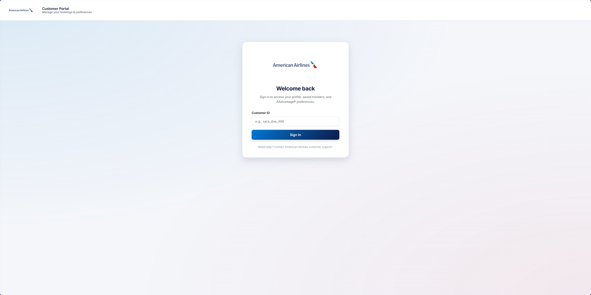
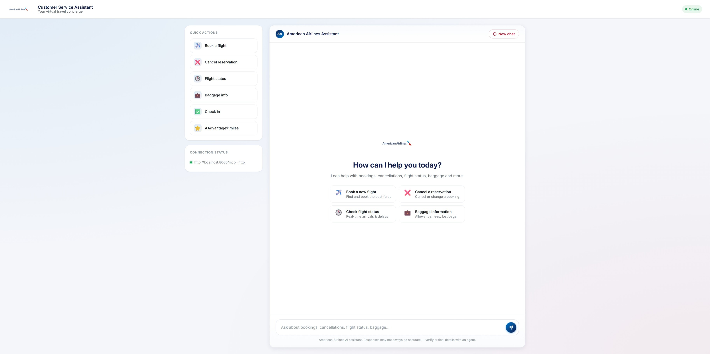
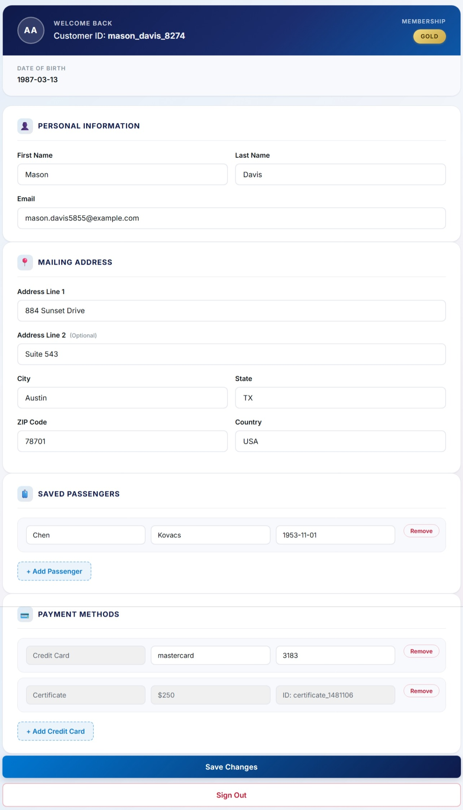
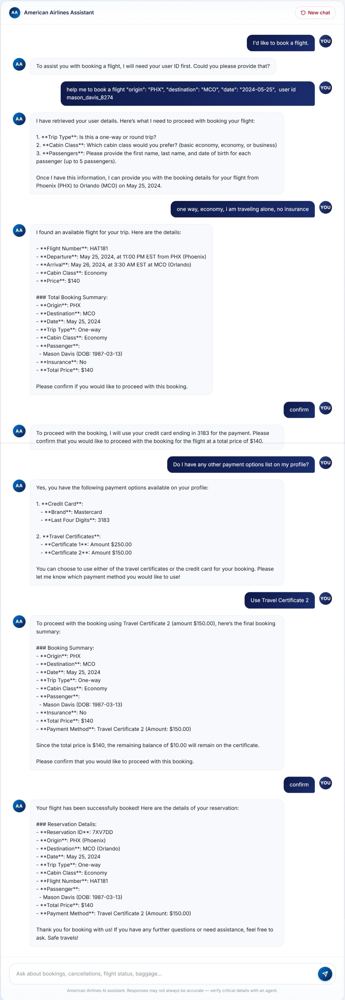

# AA Capstone — Airline Tool-Calling Agent with MCP

An end-to-end implementation of an LLM agent that books, modifies, and cancels airline reservations by calling tools exposed through the **Model Context Protocol (MCP)**. Built as the Carnegie Mellon University capstone project for the AA team, the system is benchmarked against the **τ²-bench (tau2-bench)** airline domain from Sierra Research.

The repository is split into two installable Python packages plus shared benchmark data:

| Package | Role |
| --- | --- |
| [`agent/`](agent/) | The LLM agent — connects to MCP servers, runs the reasoning loop, and exposes a CLI / web UI / benchmark harness. |
| [`mcp_airline/`](mcp_airline/) | The MCP server — registers airline tools (book, cancel, search, etc.) backed by an in-memory JSON database. |
| [`data/`](data/) | τ²-bench domain data: policy, tasks, seed database. |

---

## Development Purpose

Tool-calling agents are only as reliable as the boundary between the model and the tools it invokes. This project exists to study that boundary in a realistic, policy-heavy domain (airline customer service) and to answer four practical questions:

1. **Agent design** — How should an agent loop be structured so it reasons, calls tools, observes results, and stops cleanly?
2. **Tool design** — What does a clean MCP tool surface look like for a stateful business domain (mutating reservations, payments, baggage)?
3. **Safety** — Can a deployed agent resist direct and indirect prompt injection without becoming unhelpful?
4. **Evaluation** — How well does the agent perform against the τ²-bench airline benchmark, end-to-end, with a simulated user and policy-aware grader?

Everything in the repo is geared toward making these questions reproducible: a single command spins up the MCP server, another launches the agent, and a third runs the benchmark suite.

---

## Architecture

### Project Architecture

```text
                    ┌──────────────────────────────────────────────┐
                    │              User (CLI or Browser)           │
                    └────────────────────┬─────────────────────────┘
                                         │
                          ┌──────────────▼───────────────┐
                          │           agent/             │
                          │   ToolCallingAgent (loop)    │
                          │   ├─ PromptInjectionDetector │
                          │   ├─ ToolManager             │
                          │   └─ LiteLLM (gpt-4o-mini)   │
                          └──────────────┬───────────────┘
                                         │  MCP protocol
                                         │  (stdio or HTTP)
                          ┌──────────────▼───────────────┐
                          │         mcp_airline/         │
                          │   FastMCP server             │
                          │   ├─ tools.py (14 tools)     │
                          │   └─ AirlineDatabase         │
                          │        ├─ db.json (working)  │
                          │        └─ db.seed.json (ro)  │
                          └──────────────────────────────┘
                                         ▲
                                         │
                    ┌────────────────────┴─────────────────────────┐
                    │                  data/                       │
                    │   τ²-bench airline domain                    │
                    │   ├─ policy.md (loaded into system prompt)   │
                    │   ├─ tasks.json (benchmark scenarios)        │
                    │   └─ db.seed.json (immutable baseline)       │
                    └──────────────────────────────────────────────┘
```

### Repository Layout

```text
AA_Capstone/
├── agent/                       # Tool-calling agent package
│   ├── src/agent/
│   │   ├── agent.py             # ToolCallingAgent reason–act loop
│   │   ├── mcp_client.py        # Thin wrapper over the MCP SDK (HTTP/stdio)
│   │   ├── tool_manager.py      # Connects to N MCP servers, routes calls
│   │   ├── config.py            # LLM model + rate limiter + tau2 paths
│   │   ├── cli.py               # `agent-cli` entry point
│   │   ├── webui.py             # `agent-webui` Flask + SSE chat UI
│   │   ├── benchmark.py         # `agent-benchmark` τ²-bench runner
│   │   ├── benchmark_evaluator.py # Action-match + NL-assertion grader
│   │   ├── prompt_injection_detector.py # Lakera Guard + regex fallback
│   │   ├── injection_benchmark.py # Latency/cost benchmark for the detector
│   │   ├── rate_limiter.py      # Sliding-window decorator
│   │   ├── prompts/             # System prompt template + sim guidelines
│   │   └── templates/webui.html # Chat UI
│   ├── pyproject.toml
│   └── README.md
│
├── mcp_airline/                 # FastMCP airline server
│   ├── src/mcp_airline/
│   │   ├── app.py               # `start-airline-server` entry point
│   │   ├── server.py            # FastMCP factory + reset() admin tool
│   │   ├── tools.py             # 14 tool registrations (~870 lines)
│   │   ├── database.py          # AirlineDatabase: load/save/reload + seed
│   │   ├── web_routes.py        # Optional admin web routes (HTTP mode)
│   │   └── models.py
│   ├── ui/index.html            # Admin UI (HTTP mode)
│   ├── tests/
│   ├── pyproject.toml
│   └── README.md
│
├── data/                        # τ²-bench domain data
│   ├── airline/
│   │   ├── policy.md            # Customer-service policy → system prompt
│   │   ├── tasks.json           # Benchmark scenarios
│   │   ├── db.seed.json         # Immutable baseline (tracked in git)
│   │   └── db.json              # Working copy, mutated by tools (gitignored)
│   └── mock/                    # Minimal demo domain for smoke tests
│
├── LICENSE                      # MIT
├── .gitignore
└── README.md                    # ← you are here
```

### Tech Stack

| Layer | Technology |
| --- | --- |
| Language | Python 3.10+ |
| LLM gateway | [LiteLLM](https://docs.litellm.ai/) — provider-agnostic completion API |
| Default model | `gpt-4o-mini` (any function-calling-capable model works; see `agent/supported_models.py`) |
| Tool protocol | [Model Context Protocol (MCP)](https://modelcontextprotocol.io) — stdio + Streamable HTTP transports |
| MCP server framework | [FastMCP](https://github.com/jlowin/fastmcp) on top of Starlette |
| Agent web UI | Flask + Server-Sent Events |
| Admin web UI | Starlette (mounted on the FastMCP HTTP app) |
| Safety | [Lakera Guard](https://www.lakera.ai/) (with regex fallback) |
| Persistence | JSON files with atomic temp-file rename |
| Packaging | `setuptools` via `pyproject.toml`, installable with `uv` or `pip` |
| Benchmark | τ²-bench airline domain ([sierra-research/tau2-bench](https://github.com/sierra-research/tau2-bench)) |

---

## Development Process

### Agent Design (`agent/src/agent/`)

The agent follows the classic **reason → act → observe** loop, kept deliberately small so it's easy to reason about.

**Lifecycle of a single user turn (`ToolCallingAgent.execute`):**

1. **Pre-flight injection check.** The user message is scanned by `PromptInjectionDetector` (Lakera Guard if `LAKERA_API_KEY` is set, else a regex fallback). If flagged, a `PromptInjectionError` is raised before the LLM ever sees it.
2. **Append the user message** to `self.messages` and persist to `messages.log`.
3. **Reason loop** (up to `max_steps = 5`):
   1. `_reason()` calls the LLM via `agent_llm()` with the full message history and the OpenAI-format tool list from `ToolManager`.
   2. If the response contains tool calls, `_act()` executes each one through `ToolManager` → `MCPServerConnection.call_tool()`.
   3. Tool results are scanned again for **indirect** injection (untrusted content can come back from the database). Detected payloads are sanitised and prefixed with a warning marker rather than blocked, so the agent can still progress.
   4. Each tool invocation is recorded in `action_history` with a human-readable summary (e.g. *"Created reservation ZFA04Y"*), used later when the user asks *"what have you done?"*.
   5. The loop exits when the LLM returns text **without** tool calls.

**Cross-cutting concerns**

- **Rate limiting** — `config.rate_limiter` (sliding window, 60 calls / 60 s by default) decorates `agent_llm` and surfaces `⏱️` waiting messages that the web UI captures and streams as live SSE events.
- **System prompt assembly** — `_create_system_prompt` loads `prompts/system_prompt.txt` and substitutes `$POLICY` with `data/airline/policy.md`, so policy edits take effect on the next agent restart with no code changes.
- **Pluggable LLM** — Switching providers is a one-line edit in `config.py` (`model="gpt-4o-mini"` → any LiteLLM-supported model that supports function calling).
- **Three entry points** share the same agent core:
  - `agent-cli` — interactive REPL
  - `agent-webui` — Flask + SSE chat UI
  - `agent-benchmark` — τ²-bench runner with simulated user

### MCP Server Design (`mcp_airline/src/mcp_airline/`)

The server is a **single FastMCP instance** with a single shared `AirlineDatabase`, so all tools see (and mutate) the same in-memory state.

**Composition (`app.py` → `server.py`):**

```text
AirlineDatabase.from_tau2_bench()       # loads data/airline/db.json
        │
        ▼
create_mcp_server(database)             # FastMCP("airline-domain-server")
        │
        ├── register_tools(mcp, db)     # 14 domain tools
        └── @mcp.tool() reset()         # restore from db.seed.json (testing)
```

**Tool catalogue** (registered in `tools.py`):

| Category | Tool | Mutates DB |
| --- | --- | --- |
| Read | `get_user_details`, `get_reservation_details`, `get_flight_status`, `search_direct_flight`, `search_onestop_flight`, `list_all_airports`, `calculate` | No |
| Reservations | `book_reservation`, `cancel_reservation`, `update_reservation_flights`, `update_reservation_passengers`, `update_reservation_baggages` | Yes |
| Compensation | `send_certificate` | Yes |
| Escalation | `transfer_to_human_agents` | No |
| Admin (hidden from agent) | `reset` | Yes |

Each tool follows a consistent skeleton: **validate inputs → call `AirlineDatabase` helpers → return a JSON-serialisable string**. Mutating tools call `db.save()` to atomically persist `db.json` (write to `db.json.tmp`, then `os.replace`). The `reset` tool is registered on the server but filtered out of `ToolManager` so the agent can never call it — only the benchmark harness uses it via `tool_manager.reset_all()`.

**Database lifecycle (`database.py`):**

- `db.seed.json` — **immutable baseline**, tracked in git, sourced from τ²-bench.
- `db.json` — **working copy**, gitignored, mutated by tool calls.
- `_ensure_seed()` — on first run with only `db.json`, promotes it to `db.seed.json` so future resets have a baseline.
- `reload()` — used by the `reset` tool to restore the working copy from the seed.
- `AIRLINE_PERSIST_DB=0` — disables on-disk writes (used during benchmark runs to avoid polluting state between tasks).

**Two transports:**

- **stdio** (default) — works with the MCP Inspector and most MCP clients.
- **HTTP** — enabled by setting `PORT`. In this mode the server also mounts a Starlette admin UI at `/` that lets you browse and edit users/reservations directly, sharing the same in-memory database as the MCP endpoint.

### Benchmarking with τ²-bench

The τ²-bench airline domain ([sierra-research/tau2-bench](https://github.com/sierra-research/tau2-bench)) is the project's primary evaluation harness. The data files in `data/airline/` (`policy.md`, `tasks.json`, `db.seed.json`) are mirrored from the upstream benchmark — see `data/README.md` for the source URL.

**How a benchmark run works (`agent/src/agent/benchmark.py` + `benchmark_evaluator.py`):**

1. **Load tasks** from `data/airline/tasks.json` and filter out tasks with `initial_state` or missing `user_scenario` (these need fixtures we don't yet implement).
2. **Per task**:
   1. `tool_manager.reset_all()` — invokes the hidden `reset` tool on every connected MCP server, restoring `db.json` from the seed so each task starts from a clean baseline.
   2. Spin up a fresh `ToolCallingAgent` and a `UserSimulator` whose system prompt embeds the task's `user_scenario`.
   3. The `Orchestrator` runs a multi-turn conversation between the two for up to 15 turns or until a stop signal (`###STOP###`, `###TRANSFER###`, `###OUT-OF-SCOPE###`).
   4. The `Evaluator` checks the resulting transcript against the task's `evaluation_criteria` along two axes:
      - **Action match** — did the agent call the right tools with the right arguments?
      - **Natural-language assertions** — judged by an LLM against the conversation.
3. **Summarise** results with pass/fail per task plus an overall percentage.

This produces a reproducible, policy-aware score that's directly comparable to numbers reported by upstream τ²-bench research, while keeping the entire stack (agent loop, tool surface, safety layer) under our control.

### Safety: Prompt Injection Defence

Two-stage defence implemented in `prompt_injection_detector.py`:

- **Direct injection** — every `user` message is checked before it enters the agent loop. Hits raise `PromptInjectionError` and the request is refused.
- **Indirect injection** — every `tool` result is checked too, since tool outputs ultimately come from the database (and therefore from upstream user input). Hits are *sanitised* and tagged with a warning marker rather than blocked, so the agent stays helpful.
- Detection uses Lakera Guard when `LAKERA_API_KEY` is set, with a regex fallback for offline / unkeyed runs covering common patterns (`##MAGIC##`, "ignore previous instructions", role-playing attempts, etc.).
- `agent-injection-benchmark` measures detection latency and cost across a sample of benign and adversarial inputs.

---

## Quick Start

### Prerequisites

- Python 3.10+
- An LLM API key (OpenAI by default — see `.env` setup below)
- (Optional) [`uv`](https://docs.astral.sh/uv/) for faster installs

### 1. Install both packages in editable mode

```bash
# From the repo root
uv pip install -e ./mcp_airline
uv pip install -e ./agent
```

### 2. Configure API keys

Create `agent/.env` (gitignored):

```bash
OPENAI_API_KEY=sk-...
# Optional — enables Lakera Guard instead of regex fallback
LAKERA_API_KEY=...
```

### 3. Start the airline MCP server (HTTP mode)

```bash
PORT=8000 start-airline-server
# MCP endpoint:  http://127.0.0.1:8000/mcp
# Admin web UI:  http://127.0.0.1:8000/
```

### 4. Run the agent

```bash
# CLI
agent-cli http://localhost:8000/mcp

# or web UI
agent-webui http://localhost:8000/mcp
# then visit http://localhost:8000 (different port than the MCP server if needed)
```

### 5. Run the τ²-bench benchmark

```bash
# Run all tasks
agent-benchmark http://localhost:8000/mcp

# Filter by task ID
TASK_FILTER="15" agent-benchmark http://localhost:8000/mcp
```

For deeper details on each component, see the per-package READMEs:

- [`agent/README.md`](agent/README.md) — agent CLI / web UI / benchmark options, model switching, rate limits.
- [`mcp_airline/README.md`](mcp_airline/README.md) — server installation, MCP Inspector usage.
- [`data/README.md`](data/README.md) — τ²-bench data origin.

---

## Screenshots

A quick visual tour of the running system. Each screenshot is captured against the airline domain with the MCP server in HTTP mode and the agent web UI connected to it.

### Login




### Main Dashboard




### User Detail View




### Agent Chatbot




---

## License

This project is released under the [MIT License](LICENSE). The τ²-bench data in `data/` is mirrored from [sierra-research/tau2-bench](https://github.com/sierra-research/tau2-bench) and remains subject to its upstream license.
